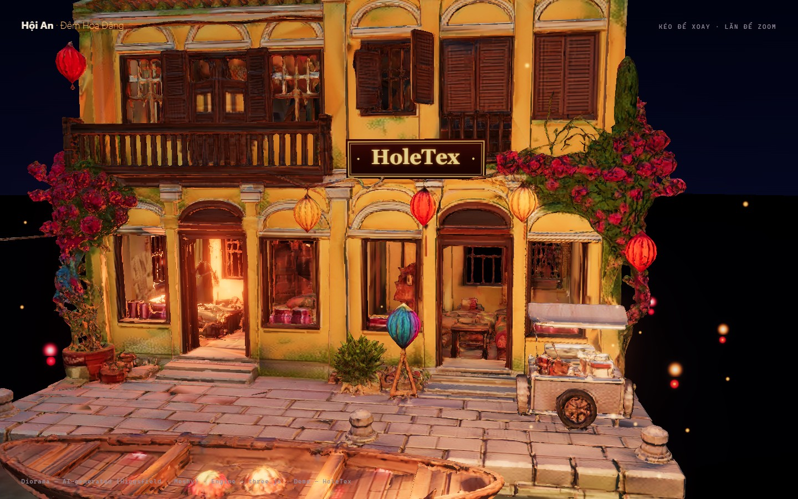
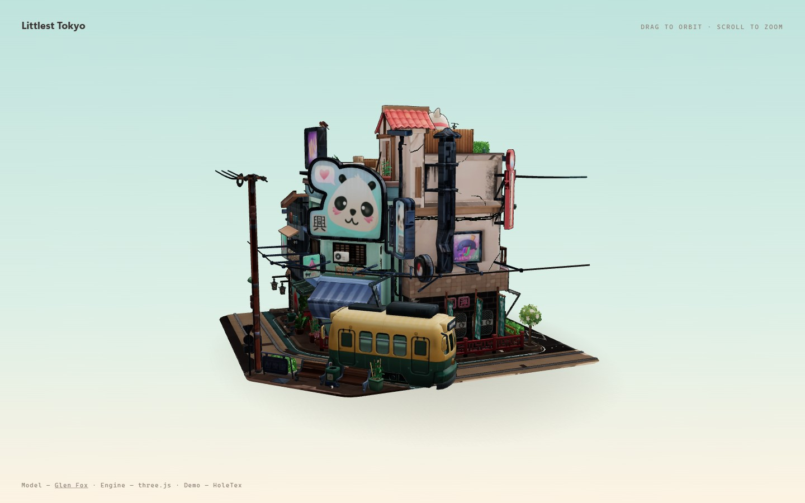

# Hội An — Đêm Hoa Đăng 🏮

An interactive WebGL diorama of Hội An's lantern night, running in the browser.


Kéo để xoay, lăn chuột để zoom. Đèn trời bay lên, hoa đăng trôi trên sông gương,
đom đóm quanh mái nhà, và một chiếc sampan chở đèn lồng tuần du quanh phố cổ.

## Chạy thử

```bash
npm install
npm run dev
# mở http://localhost:5173
```

## Pipeline

Cái hay của demo này là **asset sinh bằng AI + hiệu ứng viết bằng code**:

1. **Ảnh diorama** — generate bằng `nano_banana_pro` (Higgsfield): một khối diorama
   isometric phố cổ Hội An lúc chạng vạng, phong cách Littlest Tokyo.
2. **Ảnh → mesh 3D** — Meshy `image_to_3d` chuyển ảnh thành GLB ~150k tam giác có texture.
3. **three.js thổi hồn** — mọi thứ chuyển động là code:
   - Mặt sông phản chiếu thật (`Reflector`)
   - 42 hoa đăng trôi + 22 đèn trời bay lên + 60 đom đóm
   - Chiếc thuyền sampan được **mổ ra khỏi khối mesh lúc runtime**
     (lọc tam giác theo hộp bao, cắt tại mớn nước) rồi cho chạy vòng quanh
   - Bảng hiệu **HoleTex** sơn mài treo trên mặt tiền, đặt vị trí bằng raycast
   - Bloom, đèn flicker ấm, camera intro điện ảnh



## Render video offline

`vite.config.js` có middleware `/save-frame` + `src/main.js` có hook `window.__fixedDt`:
đóng băng vòng lặp, tua thời gian đúng 1/30s mỗi frame, chụp canvas 720 frame rồi ghép
bằng ffmpeg → clip 24s / 1080p30 mượt tuyệt đối, camera đi theo kịch bản.

## Các branch khác

| Branch | Nội dung |
|---|---|
| `main` / `feat/hoian-lantern` | Demo Hội An (chính) |
| `feat/tokyo-diorama` | Littlest Tokyo viewer — model gốc của [Glen Fox](https://www.artstation.com/glenatron), từ three.js examples |
| `feat/h1-chip-demo` | Demo chip AI procedural 100% code (fluid sim, GPGPU particles, scroll-telling) |



## Credits

- Diorama Hội An: AI-generated (Higgsfield nano-banana-pro + Meshy image-to-3d)
- Littlest Tokyo model: [Glen Fox](https://www.artstation.com/glenatron)
- Engine: [three.js](https://threejs.org)
- Build: [Vite](https://vitejs.dev)
- Demo by HoleTex, pair-built with Claude Code
